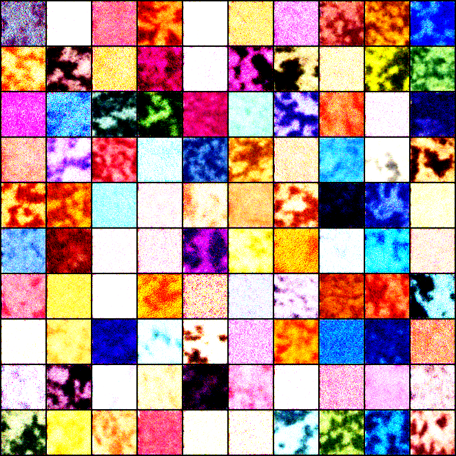

# AI

This repository contains a by no means comprehensive list of projects I've been messing around with in AI.

| Project                               | Description                                       | Date                  |
|---------------------------------------|---------------------------------------------------|-----------------------|
| `mnist`                               | Not here, MNIST digit classifer                   | March 28th, 2023      |
| [bigram](./makemore/)                 | Abandoned, toy pokemon model                      | September 17th, 2024  |
| [vit](./vit-paper/)                   | Abandoned, replicating the VIT paper              | October 2025          |
| [diffusion](./diffusion)              | Messing around with diffusion models              | October 21st, 2025    |
| [atari-agent](./atari_agent/)         | Messing around with Gymnasium                     | December 2nd, 2025    |

  

